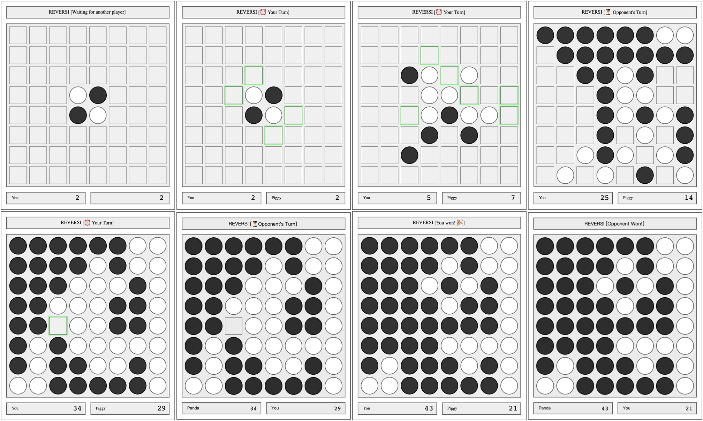

``` bash
# At least it works
cd gamebox
go get
go build
./gamebox # Port 2222,
```

1. Visit localhost:2222/ to check your name(default is 'New Player')
2. Use localhost:2222/?name=YOUR_NAME to change it to YOUR_NAME
3. Go to localhost:2222/reversi, click the Create Game button
4. Share the url with your friend, he/she could join by clicking the Join link in header
5. Enjoy

----

- [ ] Reversi // not finished
- [ ] TicTacToe
- [ ] ...

----

<figure>
  
  <figcaption>https://demo.mytools.page/reversi/403cafa0-3864-4a8e-b05d-e0ba1a78a5bf</figcaption>
</figure>
